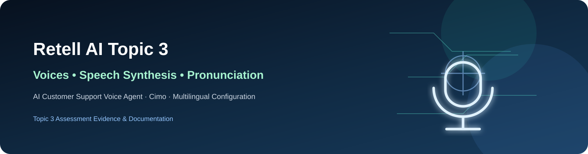

<div align="center">



# Retell AI Topic 3 — Voices, Speech Synthesis & Pronunciation

**AI Customer Support Voice Agent · Cimo · Multilingual Configuration · Voice Quality Evidence**

</div>

## 📌 Assessment Overview

This repository contains the complete evidence package for **Retell AI Topic 3: Voices, Speech Synthesis, & Pronunciation**.

The assessment focuses on speech synthesis provider selection, voice configuration, speech rate, pronunciation dictionaries, expressive voice delivery, multilingual configuration, live testing, call logs, and latency review.

---

## 🤖 Agent Configuration

| Setting | Configuration |
|---|---|
| Workspace | `my-project` |
| Agent | **AI Customer Support Agent** |
| Agent Type | Single-Prompt Agent |
| Model | **GPT 5.6 Terra** |
| Voice Provider | Retell Platform |
| Voice | **Cimo** |
| Voice ID | `retell-Cimo` |
| Speech Speed | **1.00** |
| Expressive Mode | **Enabled** |
| Volume | Normal / Middle |
| Background Sound | None |
| Languages | **English (US), English (India), Hindi (India)** |

---

## 🎙️ Speech & Voice Configuration

### Voice Provider
**Retell Platform Voice — Cimo**

### Speech Rate
**1.00**

### Expressive Mode
**Enabled** to support more natural conversational delivery.

### Pitch
Pitch is documented as **Not Available / Not Exposed** for this configuration. No unsupported pitch setting has been claimed or fabricated.

---

## 🔤 Custom Pronunciation

A custom pronunciation dictionary entry was created for the brand name:

| Field | Value |
|---|---|
| Word | **Retell AI** |
| Alphabet | **IPA** |
| Phoneme | `riːˈtɛl eɪ aɪ` |

The IPA value is stored without leading or trailing slash delimiters.

---

## 🌐 Multilingual Configuration

The saved agent contains three configured locales:

- 🇺🇸 **English (US)** — `en-US`
- 🇮🇳 **English (India)** — `en-IN`
- 🇮🇳 **Hindi (India)** — `hi-IN`

The submitted live recording did not separately validate spoken output in every configured locale.

---

## 🧪 Live Test

A final live interaction was recorded through Loom while the Retell agent was configured with the Topic 3 settings.

The test included:

1. Customer-support greeting
2. Question about Retell AI
3. Request to repeat the company name
4. Password-reset support question
5. Interruption attempt
6. Normal call closing

### Test Observation

The agent did **not** repeat “Retell AI” when asked for the company name.

Therefore:

> The pronunciation rule is correctly configured, but spoken pronunciation was **not conclusively validated** by the submitted recording.

This limitation is documented intentionally rather than claiming evidence that the recording does not contain.

---

## ⚡ Call Logs & Latency Evidence

Existing Retell call-log data was reviewed as baseline evidence.

| Metric | Observed |
|---|---:|
| LLM latency p50 | 827 ms |
| LLM latency p95 | 1555 ms |
| TTS latency p50 | 162 ms |
| TTS latency p95/p99 | 204 ms |
| ASR latency p50 | 223 ms |
| ASR latency p95 | 437 ms |
| E2E latency p50 | 1566 ms |
| E2E latency p95 | 2435 ms |
| E2E latency p99 | 2485 ms |
| Existing call duration | ~117 seconds |
| Existing call status | Successful |

**Note:** These latency figures are baseline evidence from an existing call and predate some final Topic 3 configuration changes.

---

## 📸 Evidence

The repository contains:

- Topic 3 assessment documentation PDF
- Retell voice configuration screenshots
- Pronunciation configuration evidence
- Multilingual configuration evidence
- Live-test evidence submitted through Loom

---

## ✅ Assessment Checklist

| Requirement | Status |
|---|---|
| Speech synthesis provider selected | ✅ PASS |
| Cimo voice configured | ✅ PASS |
| Speech rate configured | ✅ PASS |
| Pitch tuned | ⚪ NOT AVAILABLE — not exposed |
| Pronunciation dictionary created | ✅ PASS |
| Custom IPA pronunciation configured | ✅ PASS |
| Expressive Mode enabled | ✅ PASS |
| English (US) configured | ✅ PASS |
| English (India) configured | ✅ PASS |
| Hindi (India) configured | ✅ PASS |
| Live test recorded | ✅ PASS |
| Brand pronunciation validated by live speech | 🟡 NOT CONCLUSIVELY VALIDATED |
| Natural voice quality verified | 🟡 PARTIAL |
| Multilingual speech live-tested | 🟡 NOT TESTED |
| Call/latency evidence reviewed | ✅ PASS / BASELINE |

---

## 📂 Repository Contents

```text
retell-ai-topic-3-voice-speech-pronunciation/
│
├── README.md
├── Retell_AI_Topic_3_Assessment_Documentation.pdf
├── assets/
│   └── retell-ai-topic3-banner.svg
│
└── [Retell configuration screenshots]
```

---

## 🎥 Loom Evidence

The live-test recording is submitted through the LMS as the required Loom evidence.

---

## 📄 Assessment Documentation

**PDF:** `Retell_AI_Topic_3_Assessment_Documentation.pdf`

The PDF contains the detailed configuration, test transcript summary, latency evidence, checklist, and documented limitations.

---

<div align="center">

**Retell AI · Topic 3 Assessment · AI Customer Support Voice Agent**

</div>
